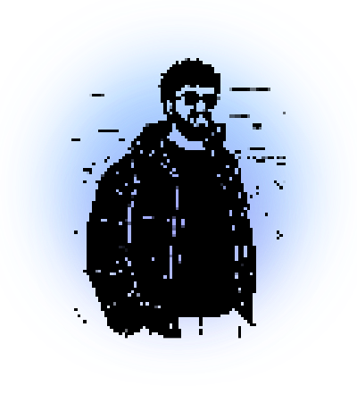

<table border="0">
  <tr>
    <td width="42%" align="center">
      
    </td>
    <td width="58%" valign="middle">

## Hrishiraj Sarmah

**Software Engineer** — Machine Learning · Backend · Distributed Systems

Building machine learning systems and the backend infrastructure they run on. Most of my week goes to distributed services, ML pipelines, and the interfaces that sit on top of them. I care about systems that stay quiet in production.

  

📍 Jaipur, India &nbsp;·&nbsp; 🌐 <a href="https://itshrs.dev">itshrs.dev</a>

</td>
  </tr>
</table>

 

### Currently

Splitting time between an early-stage social product, ad-hoc mesh networking on Android, and semantic tooling for ML codebases. Studying transformers, VLMs, and agent orchestration in parallel.

### Selected work

- **tapri** — mobile-first proximity broadcast for local discovery
- **meshlink** — registry-gated MANET mesh networking for Android
- **codesense** — semantic natural-language code search over ML pipelines
- **CLIP-EdgeNet** — CLIP-conditioned edge-aware U-Net for medical segmentation *(research, paper in progress)*

### Stack

**Languages** &nbsp;·&nbsp; Python · Java · JavaScript · TypeScript · C · SQL  
**Backend** &nbsp;·&nbsp; FastAPI · Flask · Spring Boot · SQLModel  
**Frontend** &nbsp;·&nbsp; React · Next.js · Tailwind  
**Machine learning** &nbsp;·&nbsp; PyTorch · Transformers · scikit-learn  
**Data** &nbsp;·&nbsp; Postgres · Redis · Kafka · Spark  
**Infra** &nbsp;·&nbsp; Docker · Kubernetes · AWS · Jenkins · Grafana

### GitHub

  
  

### Elsewhere

 &nbsp;  &nbsp; 
