<div align="center">
  
</div>

<br>

### `~/whoami`

Software engineer working on machine learning systems and backend infrastructure. Most of my week goes to distributed backends, ML pipelines, and shipping the interfaces that sit on top of them. I care about systems that are quiet in production and pleasant to reason about at 2 a.m.

---

### `~/building`

```yaml
tapri:       mobile-first proximity broadcast · social discovery
meshlink:    registry-gated MANET mesh networking for Android
codesense:   semantic natural-language code search over ML pipelines
research:    CLIP-conditioned edge-aware U-Net for medical segmentation
```

---

### `~/stack`

```bash
$ tree ~/stack -L 2

├── languages/    python  java  c  javascript  typescript  sql
├── backend/      fastapi  flask  spring-boot  sqlmodel
├── frontend/     react  next.js  tailwind
├── ml/           pytorch  transformers  scikit-learn
├── data/         postgres  redis  kafka  spark  supabase
├── infra/        docker  kubernetes  aws  jenkins  grafana
└── testing/      pytest  junit
```

---

### `~/signal`

<p align="left">
  
  
</p>

---

### `~/contact`

<p align="left">
  <a href="https://linkedin.com/in/YOUR_PROFILE">
    
  </a>
  &nbsp;
  <a href="https://x.com/bigOwhalee">
    
  </a>
  &nbsp;
  <a href="https://itshrs.dev">
    
  </a>
</p>

<br>

<sub><i>Building things that scale — and alarms that never go off.</i></sub>
